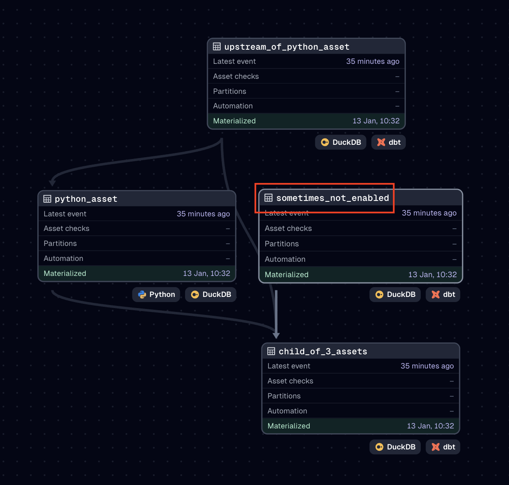

This repo demonstrates an issue I am running into with Dagster + DBT where I want to skip certain models based on a variable passed from Dagster to DBT.

# Background

## Skippable dbt model
I have a DAG that looks like this:



The highlighted model is controlled by a dbt variable called `is_non_python_interacting_dbt_asset_enabled`. If this variable is set to false, the model will be skipped.

```sql
-- dbt/models/sometimes_not_enabled.sql
{{ config( enabled=var('is_non_python_interacting_dbt_asset_enabled') ) }}
```

At the same time, in the downstream dbt asset, the relationship is also conditional:

```sql
-- dbt/models/child_of_3_assets.sql

    sometimes_not_enabled as (
        select * from {{ ref('sometimes_not_enabled') }}
    ),

```

This `var` defaults to true (see `dbt/dbt_project.yml`) but is injected at runtime by Dagster. What Dagster injects is controlled by env var `IS_NON_PYTHON_INTERACTING_DBT_ASSET_ENABLED`.

```python
# dagster/my_dg_project/assets.py
@dg_dbt.dbt_assets(manifest=dbt_project.manifest_path)
def my_project_dbt_assets(context: dg.AssetExecutionContext, dbt: dg_dbt.DbtCliResource):
    dbt_vars: dict[str, bool] = {
        "is_non_python_interacting_dbt_asset_enabled": os.getenv("IS_NON_PYTHON_INTERACTING_DBT_ASSET_ENABLED", "true").lower() == "true"
    }
    dbt_command: list[str] = ["build", "--vars", json.dumps(dbt_vars)]
    yield from dbt.cli(dbt_command, context=context).stream()
```

## Loaded dagster assets don't match `env var`
Dagster creates an asset for this model even if the `env var` is set to `false`.

This is because when Dagster creates the dbt manifest the default value of the `var` is used, not the runtime value injected by Dagster. There doesn't seem to be a way to inject the runtime var into the manifest generation step.

## Why this is a problem
When the whole dbt project is executed in one op this is not a problem, because dbt will skip the model but still materialize the downstream asset.


But when there are non-dbt assets in the middle of the dependency graph (like in this example), Dagster will create two dbt ops. It will attempt to materialize as many as it can in the first one. In this example that includes the configurable asset because it's not upstream or downstream of the non-dbt asset.

Then in the second dbt op, Dagster will try to materialize the downstream dbt asset that depends on the skipped model. But because the model was skipped and never materialized, Dagster will stop the materialization of the downstream assets.


## In summary
The core issue is that Dagster's understanding of the dbt asset graph (from the manifest) does not match the actual dbt asset graph at runtime because of the variable injection.

# How to recreate the issue

## Prerequisites
- uv installed

## Setup
1. Clone this repo

## The undesired behavior
1. `cd dagster`
1. `echo "IS_NON_PYTHON_INTERACTING_DBT_ASSET_ENABLED=false" > .env` to create a .env file with an env var that controls the runtime dbt var dagster will pass to dbt
1. `uv run make dagster` to start the dagster instance.
1. Materialize all assets. You will see that the `downstream_dbt_asset` fails to materialize because its upstream dependency `non_python_interacting_dbt_asset` was skipped.

## The desired behavior
1. `cd dbt`
1. `uv run dbt build --vars '{is_non_python_interacting_dbt_asset_enabled: false}'` to see that dbt correctly skips the model when the var is set to false and yet still materializes the downstream asset.